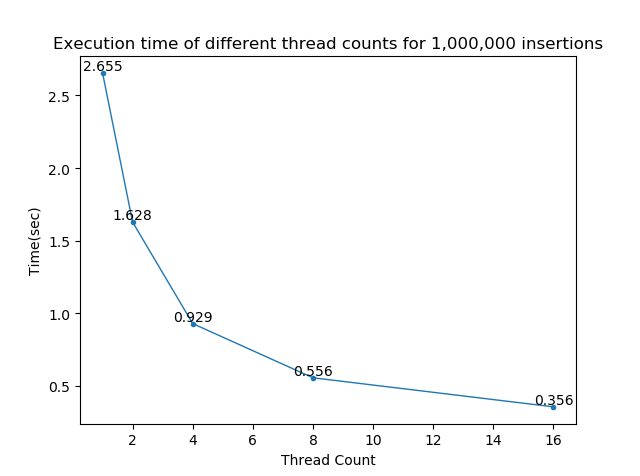
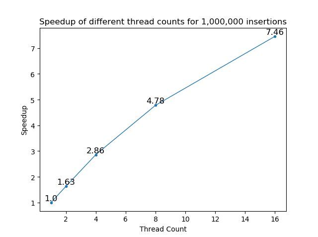

## Lock-Free Red-Black Tree Using CAS - checkpoint report

Our team: Shun Zhang, Guancheng Li

[Project proposal](https://zhangshun97.github.io/project/proposal/)

[Final report](https://zhangshun97.github.io/project/assets/15618_final_report.pdf)

[GitHub repository](https://github.com/zhangshun97/15618_final)

---

### Detailed schedule

| Time          | Task(s)                                                      | Main contributor(s) |
| ------------- | ------------------------------------------------------------ | ------------------- |
| 11/18 - 11/21 | 1. try to implement remove() with the marker mechanism       | Guancheng Li        |
|               | 2. integrate all test cases and do various tests             | Shun Zhang          |
| 11/22 - 11/24 | 1. maybe still working on the remove() part, which is very tricky to implement | Guancheng Li        |
|               | 2. help with remove() implementation                         | Shun Zhang          |
|               | 3. if remove() completes, then start testing with full functionality of the tree | Shun Zhang          |
| 11/25 - 11/28 | 1. start writing the final report                            | Guancheng Li        |
|               | 2. extra plan: start implementing fine-grained lock version  | Shun Zhang          |
| 11/29 - 12/01 | 1. hopefully finish fine-grained lock version and start testing | Shun Zhang          |
|               | 2. add more details to the report                            | Guancheng Li        |
| 12/02 - 12/05 | 1. writing report 2. safe days for unexpected situations     | Both of us          |
| 12/05 - 12/08 | 1. finish final report 2. maybe make a poster (rather than just report pages) | Both of us          |

### Work completed so far

- sequential red-black tree
- the lock-free insert operation based on CAS (still working on remove operation)

### Preliminary results

We have done some tests on GHC machines to compare the performance of our serial insertion and our lock-free insertion based on CAS.

The GHC machine we used has an eight-core, 3.2 GHz Intel Core i7 processor enabling Hyper-Threading Technology, which means it has 16 threads in total. We tested our program with 1, 2, 4, 8 and 16 threads on it, letting the program to perform 1,000,000 insert operations on single red-black tree. The program running on single thread presents the performance of the serial version.

The execution time and speedup of different threads are listed in the following figures. We can see that as the number of threads increases, the speedup becomes further from the ideal linear speedup. In our opinion, the reason is that more threads bring more contention. In our implementation, each time a thread fails on a CAS operation, it needs to roll back, which means it will release all the flags it already has and then retry the whole process. Under high contention, the threads will spend more time on rolling back and retrying, which has a negative effect on the performance.

### Plan to show at poster session

We would like to compare the performance of lock-free version against lock version, coarse-grained or fine-grained and show some comparing figures mainly on the **scalability** of these implementations.

### Issues and concerns

The remove function in the lock-free version is very tricky and the paper we refer to is somewhat vague on the implementation of the so-called marker mechanism. This mechanism enforces a safe distance between two threads that without dosing so, deadlock may occur during their removing procedure. Normally, lock-free implementation will guarantee that at least one thread will make some progress, but in the red-black removing procedure, it may need several iterations to complete and it's impossible to go back to the situation before that removing if some iterations has been performed.

### Revised goals (hope not)

Based on the concerns above, we should take into consideration that **if** we fail to implement the lock-free remove, we will change our goal to mainly focus on lock-free insertion and finish fine-grained lock version as our main goal instead.
